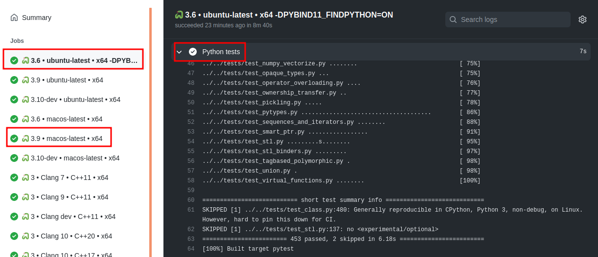

# RobotLocomotion Fork of `pybind11` for Drake

This fork is developed for use in [Drake](drake.mit.edu/), and provides the
following features on top of the main development:

* NumPy:
  * Incorporates https://github.com/pybind/pybind11/pull/1152 (with fixes):
  Permit creating matrices with `dtype=object`.
* Transferring ownership between C++ and Python using `py::wrapper<Class>`
  * Resolves https://github.com/pybind/pybind11/issues/1132: Casting from Python to C++ `unique_ptr<Class>`.
  * Resolves https://github.com/pybind/pybind11/issues/1145: Transfer of
  ownership of subclasse between C++ and Python with `shared_ptr<Class>`
  * Resolves https://github.com/pybind/pybind11/issues/1138: Helpful error
  message when mixing holder types at runtime.
* Other modifications:
  * Resolves https://github.com/pybind/pybind11/issues/1238: Deregister
  instances by type and pointer.

For usage in Drake, please see the following pages in Drake:

* [User: Python Bindings](https://drake.mit.edu/python_bindings.html#using-the-python-bindings)
* [Dev: Python Bindings](https://drake.mit.edu/doxygen_cxx/group__python__bindings.html)
* [User: API Reference](https://drake.mit.edu/pydrake/index.html)

## Maintenance Philosophy

This repository should be updated to synchronize with upstream at least every 3
months to ensure that we have core bugfixes and features.

When developing features or bugfixes in this fork that are relevant to upstream
features, first try to make a descriptive upstream issue to see if it is
something desirable for upstream, and make a PR for the community to see and
possibly review. Then continue developing here.

Reviewable for non-upstream updates should happen using Reviewable.

Please do not make superfluous (non-functional) changes to the original
`pybind11` source code (e.g. no whitespace reflowing), and try to stay
relatively close to `pybind11`s style for consistency.

## Continuous Integration

For simplicity, these checks are copied from upstream's CI which uses GitHub
Actions as part of GitHub's checks. They test:

* Code formatting (Python, C++, CMake)
* Latest Ubuntu and macOS images
    * **drake specific**: Windows and centOS disabled
* C++11 and C++17
* Release and debug builds
* GCC and clang
* 64bit
    * **drake specific**: no 32bit since Windows is disabled
* CPython
    * **drake difference**: PyPy is disabled
* Python 3.6, 3.7, and 3.8
    * **drake difference**: Python 2.7 and 3.5 are disabled

### Quick Testing

For quickly testing Drake modifications on the platform's Python 3 interpreter:

    mkdir build && cd build
    cmake .. \
        -DPYBIND11_TEST_OVERRIDE='test_builtin_casters.cpp;test_class.cpp;test_eigen.cpp;test_multiple_inheritance.cpp;test_ownership_transfer.cpp;test_smart_ptr.cpp'
    make -j 4 pytest

## Local Git Setup

For development, please make your own GitHub fork of the upstream repository.

It is suggested to clone this repository with the following remotes:

    # Clone from upstream.
    git clone --origin upstream https://github.com/pybind/pybind11
    cd pybind11
    git remote set-url --push upstream no_push
    # Add robotlocomotion.
    git remote add robotlocomotion https://github.com/RobotLocomotion/pybind11
    git remote set-url --push robotlocomotion no_push
    # Add origin (your fork).
    git remote add origin <url-to-your-fork>
    # Fetch from all remotes.
    git fetch --all
    # Checkout to track robotlocomotion/drake.
    git checkout -b drake robotlocomotion/drake

## Branches

The following branches are used:

* `drake` - This is the active development branch, forked from `upstream/master`
* `no_prune` - This is now a stale branch, meant to keep track of prior
versions that were rebased. This should be kept for historical purposes.

## Submitting PRs

* Submit your PR to `RobotLocomotion/pybind11` (targeting `drake`) and request
review.
  * Ensure that the PR passes the Travis CI checks!
* Submit a PR to Drake using the latest commit from your `pybind11` PR. Ensure
experimental CI passes, and be sure to include macOS. An example of requesting
macOS testing in Drake:

        @drake-jenkins-bot mac-catalina-clang-bazel-experimental-everything-release please

* Once your PR is reviewed, accepted, and CI passes, merge your
`RobotLocomotion/pybind11` PR, then update your Drake PR to use the latest
merge commit for the fork:

        cd pybind11
        git fetch robotlocomotion
        git rev-parse robotlocomotion/drake

* Merge the Drake PR once it passes CI and review is finished.

### Pulling Upstream Changes

This repository should be merged with upstream (the official repository) about
every 3 months. We use a merge strategy (not rebase) with Git so that updates
can be a simple fast-forward merge.

To update the repository, first checkout the branch and merge:

    git fetch robotlocomotion && git fetch upstream
    git checkout -b <new-branch-name> robotlocomotion/drake
    # Record the soon-to-be-old merge-base.
    git merge-base upstream/master robotlocomotion/drake
    # Merge.
    git merge upstream/master  # Resolve conflicts and commit
    git push --set-upstream origin <new-branch-name>

If you need to make non-trivial merge-conflict resolutions, please do so as
additional commits so that reviewers can easily separate these more acute
changes from the merge itself. (This is so that reviewers only review *novel*
code, rather than code that upstream reviewers already looked at.)

Then create a `RobotLocomotion/pybind11` PR with your branch. Title the PR as
`Merge 'upstream/master' (<sha_new>)`,
where `<sha_new>` is the short-form SHA of the current `upstream/master`.

In the PR's overview, please add the following checklist for both you and the
reviewer (replacing anything in brackets `<...>` with the appropriate values:

```md
For the author:

- [ ] Ensure downstream CI passes (including Mac): <link to Drake PR>

For the reviewer:

- [ ] Does the commit title look correct? (does it only contain up to
`<sha_new>` of upstream?)
- Are the canary builds "correct"?  (look at the
[checks](#partial-pull-merging); for each CI configuration, expand the output
under `Python tests` (which are for C++17) - we shouldn't be accidentally
missing tests, etc.)
  - [ ] `CI / 🐍 3.6 • ubuntu-latest • x64 [...]`: [base](<link>) vs. this PR's results for
  `CI / 🐍 3.6 • ubuntu-latest • x64`
  - [ ] `CI / 🐍 3.9 • macos-latest • x64`: [base](<link>) vs. this PR's results for
  `CI / 🐍 3.9 • macos-latest • x64`
- [ ] Do the drake-specific changes look good? (all commits after the merge
commit)
```

To get `<link>` for the given base CI results:

* Use the most recent result from the following link:
[workflow: CI, branch: drake](https://github.com/RobotLocomotion/pybind11/actions?query=workflow%3ACI+branch%3Adrake+is%3Acompleted)
* Click on the relevant job (i.e.
`🐍 3.6 • ubuntu-latest • x64` or `🐍 3.9 • macos-latest • x64`)
* Expand `Python tests C++17`, and click on the the line number where
`short test summary info` is printed

Example:
<https://github.com/RobotLocomotion/pybind11/runs/2036808833?check_suite_focus=true#step:17:63> (this link may
expire, hence the screenshot)



### Cherry-Pick Upstream Changes

This should only be done when there is an acute feature needed, but there is
high overhead in incorporating all upstream changes.

Follow the same procedure as above, but name your PR as
`Cherry pick <shas> from upstream/master`, and be sure to reference the
upstream PRs.

Any non-trivial changes should still happen as separate commits to simplify
review.
