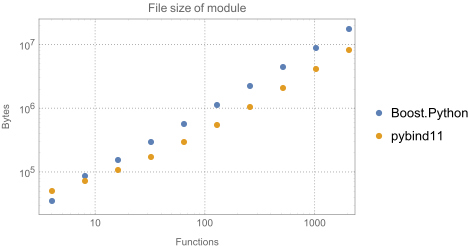

Benchmark
=========

The following is the result of a synthetic benchmark comparing both compilation
time and module size of pybind11 against Boost.Python.

A python script (see the ``docs/benchmark.py`` file) was used to generate a
set of dummy classes whose count increases for each successive benchmark
(between 1 and 512 classes in powers of two). Each class has four methods with
a randomly generated signature with a return value and four arguments. (There
was no particular reason for this setup other than the desire to generate many
unique function signatures whose count could be controlled in a simple way.)

Here is an example of the binding code for one class:

.. code-block:: cpp

    ...
    class cl034 {
    public:
        cl279 *fn_000(cl084 *, cl057 *, cl065 *, cl042 *);
        cl025 *fn_001(cl098 *, cl262 *, cl414 *, cl121 *);
        cl085 *fn_002(cl445 *, cl297 *, cl145 *, cl421 *);
        cl470 *fn_003(cl200 *, cl323 *, cl332 *, cl492 *);
    };
    ...

    PYBIND11_PLUGIN(example) {
        py::module m("example");
        ...
        py::class_<cl034>(m, "cl034")
            .def("fn_000", &cl034::fn_000)
            .def("fn_001", &cl034::fn_001)
            .def("fn_002", &cl034::fn_002)
            .def("fn_003", &cl034::fn_003)
        ...
        return m.ptr();
    }

The Boost.Python version looks almost identical except that a return value
policy had to be specified as an argument to ``def()``. For both libraries,
compilation was done with

.. code-block:: bash

    Apple LLVM version 7.0.0 (clang-700.0.72)

and the following compilation flags

.. code-block:: bash

    g++ -Os -shared -rdynamic -undefined dynamic_lookup -fvisibility=hidden -std=c++11

The following log-log plot shows how the compilation time grows for an
increasing number of class and function declarations. pybind11 includes fewer
headers, which initially leads to shorter compilation times, but the
performance is ultimately very similar (pybind11 is 1 second faster for the
largest file, which is less than 1% of the total compilation time).

.. image:: pybind11_vs_boost_python1.svg

Differences between the two libraries become more pronounced when considering
the file size of the generated Python plugin. Note that the plot below does not
include the size of the Boost.Python shared library, hence Boost actually has a
slight advantage.

Despite this, the libraries procuced by Boost.Python for more than a few
functions are consistently larger by a factor of 1.75.
